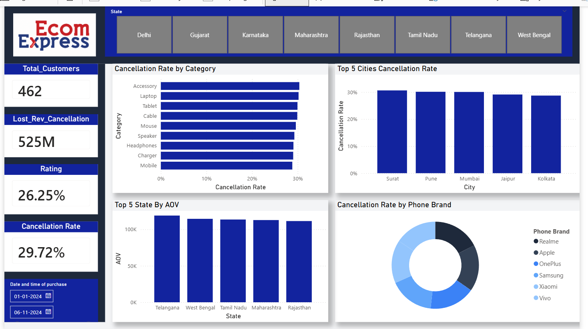
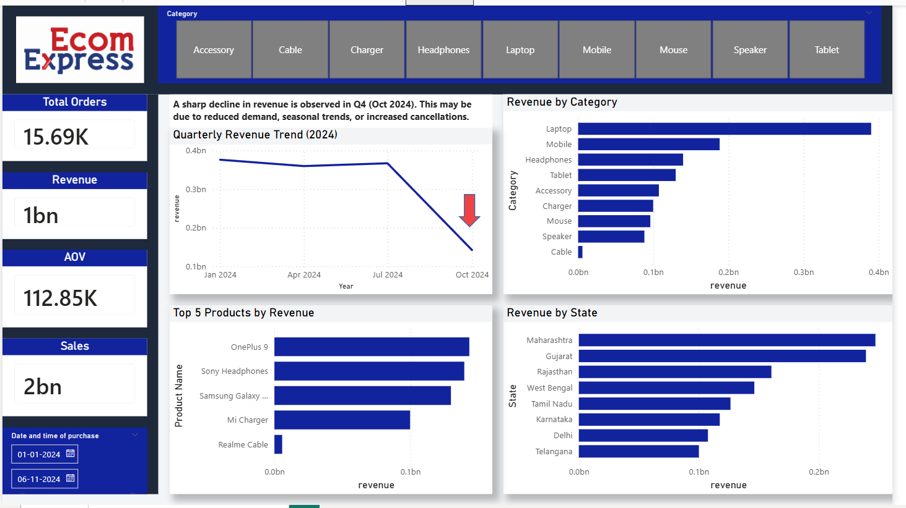

# 📊 Ecom Express Power BI Dashboard

A professional data analytics dashboard built using **Power BI** to analyze business performance of Ecom Express.  
It provides insights into revenue trends, customer behavior, cancellation rates, and product/category performance.

---

## 🚀 Project Objective

The goal of this project is to transform raw logistics data into meaningful business insights for better decision-making.

---

## 📸 Dashboard Preview

### 📍 Overview Dashboard

### 📍 Detailed Insights Dashboard

---

## 📈 Key Business Insights

- 📊 Revenue performance tracking across time
- 👥 Customer analysis (new vs returning customers)
- ❌ Cancellation rate analysis by category & city
- 🏆 Top 5 products by revenue
- 📦 Category & sub-category performance breakdown

---

## 🛠 Tools & Technologies Used

- Power BI Desktop
- Microsoft Excel / CSV Dataset
- Data Cleaning & Transformation (Power Query)
- DAX Measures & Calculations

---

## 📁 Project Files

- `dashboard.pbix` → Main Power BI file  
- `screenshot1.png` → Dashboard overview  
- `screenshot2.png` → Detailed analysis view  
- `README.md` → Project documentation  

---

## 📊 Dashboard Features

- Interactive filters & slicers
- Dynamic KPI cards
- Drill-down analysis
- Clean and user-friendly UI
- Business-focused insights

---

## ⚡ How to Use

1. Download the repository
2. Open `dashboard.pbix` in Power BI Desktop
3. Refresh data if required
4. Explore interactive visuals

---

## 👩‍💻 Developed By

**Pragya Malviya**  
Aspiring Data Analyst | Power BI Enthusiast  

---

## ⭐ Note

This project is created for learning and portfolio purposes to demonstrate data analysis and visualization skills.

---
